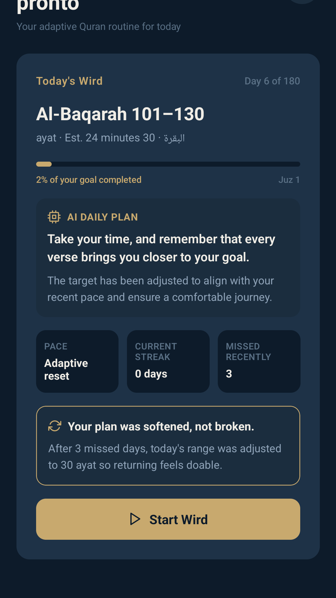
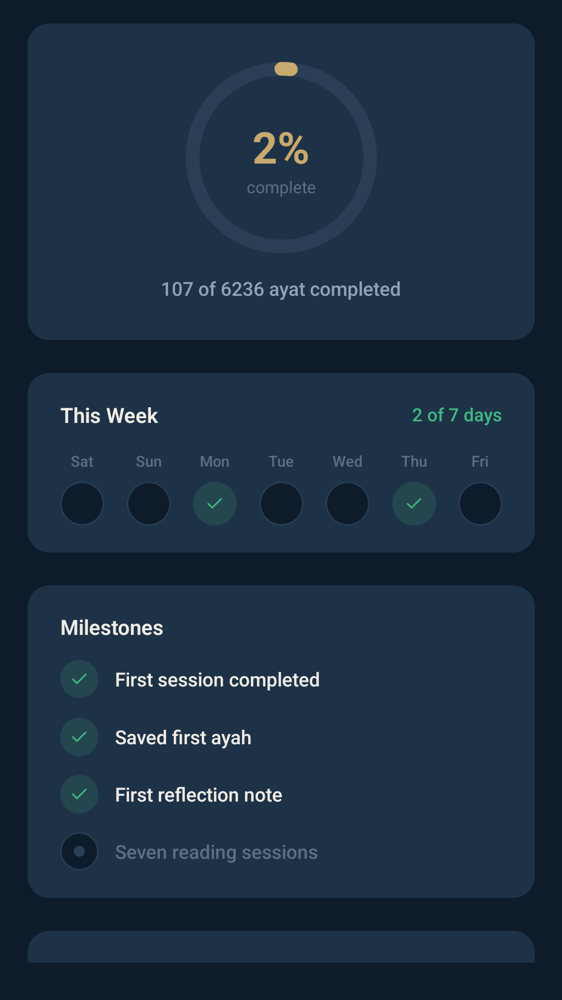
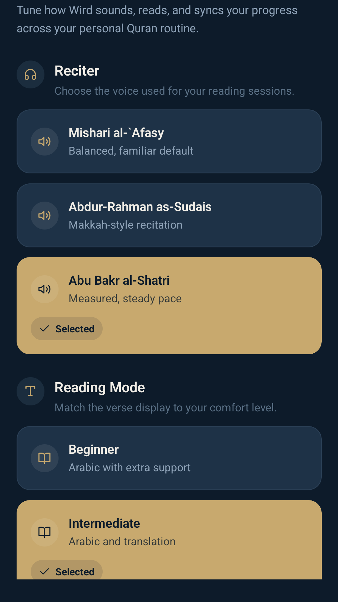

<div align="center">

# Wird (وِرْد)

**An AI-powered daily Quran companion that adapts your reading routine when life interrupts it and turns every session into tafsir-grounded reflection — built to help believers sustain their Ramadan momentum year-round.**

[](https://play.google.com/store/apps/details?id=com.prontoville.wird)
[](#demo-video)
[](https://launch.provisioncapital.com/quran-hackathon)

**📱 Live demo:** [Wird on Google Play](https://play.google.com/store/apps/details?id=com.prontoville.wird)
**🎬 Demo video:** [Watch on YouTube](https://youtube.com/shorts/4f9pyuMYoaM?feature=share) — script in [docs/demo-video-script.md](docs/demo-video-script.md)
**👤 Author:** Yusuf Adolat — solo submission

</div>

---

## The Problem

Every Ramadan, millions of Muslims read the Quran daily. Two weeks after Eid, most have stopped. The problem isn't desire — it's that habit apps respond to missed days with **guilt, broken streaks, and generic reminders**. Once the streak breaks, users disengage entirely.

## The Solution

**Wird replaces streak guilt with mercy.** It uses AI to build a personalized daily reading plan, adapts that plan when life interrupts the routine, and grounds every reflection in authentic Quran Foundation tafsir — so believers return to the Quran with consistency instead of shame.

> The AI is in the **planning and reflection layer**, never in generating Islamic content. Every verse, translation, tafsir, and audio file is delivered from Quran Foundation's official APIs.

---

## Screenshots

| Home — AI daily plan | Progress — weekly engagement | Saved — bookmarks | Settings |
| :---: | :---: | :---: | :---: |
|  |  |  |  |

---

## Core Features

- **Adaptive daily wird** — AI generates a personalized reading plan from your goal, recent history, and available time
- **Mercy-based recalibration** — miss a day, miss a week? The plan gently re-scopes instead of punishing you
- **Authentic reader** — verses, translations, tafsir, and audio all streamed from Quran Foundation Content APIs
- **Tafsir-grounded reflection** — every post-session reflection prompt is rooted in the tafsir you just read, not a blank AI slate
- **Cross-device sync** — bookmarks, reading sessions, and activity sync via Quran Foundation User APIs + OAuth
- **Quiet by design** — no streak counters, no guilt notifications, no gamification

---

## How Wird Uses Quran Foundation APIs

Wird integrates **4 Content APIs**, **OAuth 2.0 with PKCE**, and **2 User API groups (5 endpoints)** — 11 distinct endpoints in total. Every call has a concrete user-facing purpose, not a token integration.

### Environment Targeting
| Environment | Content API | User API | OAuth |
|---|---|---|---|
| Pre-live *(default for judging)* | `api.qurancdn.com/api/qdc` | `apis-prelive.quran.foundation/auth/v1` | `prelive-oauth2.quran.foundation` |
| Production | `api.qurancdn.com/api/qdc` | `apis.quran.foundation/auth/v1` | `oauth2.quran.foundation` |

Toggle via `EXPO_PUBLIC_QF_USE_PRODUCTION=true`. Runtime config: [lib/config.ts](lib/config.ts).

### Content APIs — [services/quranApi.ts](services/quranApi.ts)

| Endpoint | Wird feature | Function |
|---|---|---|
| `GET /verses/by_key/{verseKey}` | Single-ayah lookup with translation + tafsir for reflection | `fetchVerseByKey` |
| `GET /verses/by_chapter/{id}` | Paginated verse range for the daily wird reader | `fetchVerseRange` |
| `GET /chapters` | Surah picker + adaptive planner's knowledge of verse counts | `fetchChapters` |
| `GET /chapters/{id}` | Chapter header in reader | `fetchChapterById` |
| `GET /tafsirs/{tafsirId}/by_ayah/{verseKey}` | Inline tafsir panel + grounding source for AI reflection prompts | `fetchTafsirByAyah` |
| `GET /chapter_recitations/{reciterId}/{chapter}` | Full-surah audio with per-ayah timestamps for follow-along player | `fetchChapterAudio` |
| `GET /recitations/{reciterId}/by_ayah/{verseKey}` | Single-ayah audio for tap-to-play in reflection | `fetchVerseAudioUrl` |

Defaults: translation `131` (Mustafa Khattab), tafsir `169` (Ibn Kathir), reciter `7` (Mishari Al-Afasy). HTML is stripped server-side before rendering — **the AI only summarizes verified tafsir, never synthesizes scripture**.

### OAuth 2.0 with PKCE — [lib/quranAuth.ts](lib/quranAuth.ts)

1. Client generates PKCE challenge and opens `expo-auth-session` browser tab to `{OAUTH_BASE_URL}/oauth2/authorize`.
2. Redirect returns an authorization code to `wird://auth/callback`.
3. App POSTs code + verifier to the **Supabase edge function** [quran-auth-exchange](supabase/functions/quran-auth-exchange/index.ts), which performs the server-side token exchange — keeping the client secret off-device.
4. Tokens stored in `expo-secure-store` via [services/authStorage.ts](services/authStorage.ts).

Tests in [lib/quranAuth.test.ts](lib/quranAuth.test.ts).

### User APIs *(OAuth-authenticated)* — [services/quranUserApi.ts](services/quranUserApi.ts)

Headers on every request: `x-auth-token: {access_token}`, `x-client-id: {client_id}`, optional `x-timezone: {IANA zone}`.

| Endpoint | Wird feature | Function |
|---|---|---|
| `POST /bookmarks` | Save verse from reader's long-press menu | `createQuranBookmark` |
| `GET /bookmarks?type=ayah&key={chapter}` | List bookmarks in the Saved tab | `removeQuranBookmarkByVerseKey` |
| `DELETE /bookmarks/{id}` | Unbookmark from Saved tab | `removeQuranBookmarkByVerseKey` |
| `POST /reading-sessions` | Record completion of today's wird | `syncQuranReadingSession` |
| `POST /activity-days` | Log reading time + verse ranges with IANA timezone for correct day-bucketing | `syncQuranActivityDay` |

Every completed wird emits both `reading-sessions` and `activity-days` records — so the user's progress is visible across any Quran Foundation-connected surface, not just Wird. This is what turns Wird from a silo into a citizen of the Quran Foundation ecosystem.

### Feature → API Map *(judge quick-reference)*

| User action | APIs touched |
|---|---|
| Open Home — see today's AI plan | Chapters |
| Open Reader → tap play | Verses, Audio, Tafsir |
| Long-press ayah → bookmark | Bookmarks `POST` |
| Complete session → reflection | Tafsir, Reading Sessions `POST`, Activity Days `POST` |
| Sign in with Quran.com | OAuth 2.0 PKCE + Supabase edge proxy |
| Open Saved tab | Bookmarks `GET` |

### Sync Strategy
[services/syncService.ts](services/syncService.ts) orchestrates local-first writes (Supabase Postgres + AsyncStorage) so the app works offline, with best-effort remote sync to Quran Foundation User APIs when authenticated. A failed sync never interrupts reading — the **mercy philosophy extends to the network**.

**Deeper reference:** [docs/API_USAGE.md](docs/API_USAGE.md) has full request/response notes.

---

## Tech Stack

- **Mobile:** React Native 0.83 · Expo SDK 55 · TypeScript · Expo Router
- **State:** Zustand stores ([store/](store/))
- **Auth:** OAuth 2.0 PKCE via `expo-auth-session` → Supabase edge function → Quran Foundation token exchange
- **Backend:** Supabase (Postgres + edge functions for AI reflection + adaptive planning)
- **AI layer:** OpenAI GPT-4o-mini, confined to plan generation and reflection prompts (never content generation)
- **Observability:** Sentry
- **Audio:** `expo-audio` with per-ayah streaming

---

## Rubric Alignment

| Criterion | Points | How Wird Scores |
|---|---|---|
| **Impact on Quran Engagement** | 30 | Directly targets the post-Ramadan drop-off with adaptive, guilt-free re-entry. Reflection moves users from reading to understanding. |
| **Product Quality & UX** | 20 | Calm dark-navy interface, unified design system, onboarding tuned to 3 taps. |
| **Technical Execution** | 20 | OAuth PKCE working end-to-end, Expo doctor passing, Sentry monitoring live, Supabase edge functions deployed. |
| **Innovation & Creativity** | 15 | Adaptive routine + mercy-based recalibration — a category of its own, not another streak tracker. |
| **Effective API Use** | 15 | Four Content APIs + OAuth + two User APIs, each with purpose, not surface-level. |

---

## Running Locally

```bash
# 1. Install
npm install

# 2. Configure environment
cp .env.example .env
# Fill in EXPO_PUBLIC_QF_* values from Quran Foundation developer console
# Supabase URL/anon key from your Supabase project (optional for local dev)

# 3. Start
npm start           # Expo dev server
npm run android     # or run directly on Android
npm run ios         # or iOS
```

## Building for Release

EAS manages `versionCode` remotely with `autoIncrement: true` — every production build gets a fresh Play Store-accepted version code automatically. Bump the user-visible `version` in `app.json` when the changelog warrants it.

```bash
# Preview / internal testing APK
npm run build:preview:local        # builds on your laptop
npm run build:prod:local:aab       # production AAB, built locally

# Production AAB via EAS cloud (no local Android toolchain needed)
npm run build:prod:aab             # kicks off cloud build, watch progress in EAS dashboard
npm run build:list                 # inspect recent builds and their status

# Ship to Play Store (beta track, per eas.json submit config)
npm run submit:prod                # submits the latest cloud build
npm run release:prod               # build + auto-submit in one command
```

Brand assets live in `assets/brand/` (SVG sources) and `assets/store/` (Play listing icon, feature graphic, phone screenshots).

---

## Project Structure

```
app/              Expo Router screens (tabs, reader, reflection, auth)
components/       UI primitives (design system)
constants/        Theme (colors, spacing, radii)
lib/              Auth client, config, Sentry, Supabase client
services/         Quran Content API + User API clients
store/            Zustand stores (auth, onboarding, wird, app data, settings)
supabase/         Edge functions (quran-auth-exchange, reflection AI)
docs/             Hackathon brief, demo-video script, API usage, release notes
```

---

## Submission Links

- **Repository:** https://github.com/Yusadolat/wird
- **Live demo (Play Store):** https://play.google.com/store/apps/details?id=com.prontoville.wird
- **Demo video:** https://youtube.com/shorts/4f9pyuMYoaM?feature=share
- **Hackathon page:** https://launch.provisioncapital.com/quran-hackathon

## License

Private to the author during the hackathon judging period. Licensing will be finalized after the submission deadline (2026-04-20).

---

*"Wird is not trying to gamify the Quran. It is trying to help people return to it."*
